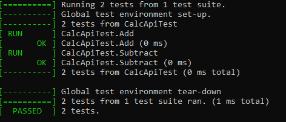
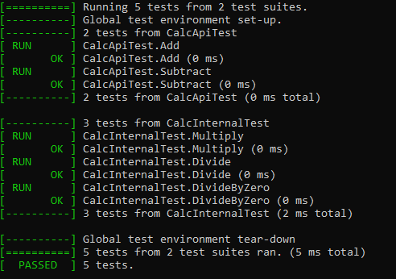
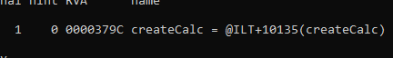
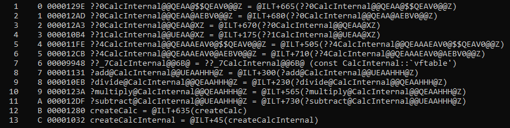

# Testing Structures: Unit Tests, BDD and Visual Testing

## Ensuring High-Quality Software
Developing high-quality software is crucial, as it underpins many essential aspects of modern life, including healthcare systems, transportation infrastructure, communication networks, financial services, scientific research, environmental management, and national security. To create reliable, secure, and efficient software that meets users' needs and drives these critical domains forward, developers must adopt rigorous requirements gathering and validation methods.

Testing is a critical part of software development, as it helps identify defects early in the process, reduces the risk of defects in production, and ensures the software meets user needs. Common testing structures include unit tests, BDD (Behavior-Driven Development), and visual testing.

The accompanying project is aimed to be at starting level including some unit testing and CMake controlled development time exposing.

## BDD and TDD
BDD focuses on defining and describing software system behavior in an easily understandable way for all stakeholders. BDD tests use a natural language syntax to describe the system's expected behavior from different actors' perspectives. TDD is an approach derived from BDD that employs automated tests to confirm code meets test case requirements, enabling easier maintenance and early detection of regressions or defects.

### The Three-Step Process of TDD within BDD
1. Identify Behavior: Developers identify the behavior they want to implement.
2. Write Test: Developers write an automated test describing the desired behavior.
3. Write Code: Developers write code to pass the automated test.

### Benefits of Combining TDD with BDD
- Clearer requirements: BDD provides easily understood behavior definitions, reducing misunderstandings and defects.
- Faster feedback loop: TDD within BDD enables early defect detection, streamlining the development process.
- Enhanced testing: BDD focuses on system behavior from various perspectives, enabling targeted and effective testing.
- Reduced risk of defects: TDD within BDD prevents defects from reaching production, improving software stability and reliability. Plain TDD, well, does not succeed in same rate.

## Visual Testing
Visual testing evaluates software appearance rather than functionality. Tools capture software screenshots in various states and compare them to baseline images to detect visual defects. Visual testing ensures the software meets user needs in terms of appearance and usability, detecting defects that functional or unit testing may miss.

## Development Time Debug API
In addition to unit tests, BDD and visual testing, development-time debug APIs enable developers to inspect software states during development and identify potential defects or issues. Logging, tracing, and debugging tools assist in recording events, tracking software execution, and identifying and fixing defects, respectively.

## Conclusion
Unit tests, TDD within BDD, BDD and visual testing are essential testing structures for ensuring software quality and reliability. By using these structures, developers can detect and prevent defects early in the development process and ensure that software meets user needs. However, other testing methods like integration, functional, performance, security, usability and acceptance testing are also necessary to further enhance software quality. No testing approach can guarantee defect-free software, but the goal is to minimize defects and improve overall quality as much as possible.

Originally, this demonstration was planned to be a graphical one, but it was simplified due to its growing complexity(make it a multipart?). Below are some images illustrating the test results with and without development time expose.

From these images, you can see how the exposing comes to life. I think this is enough for now and as previously mentioned, this can be a multipart topic. In the next part, when I have the interest to continue, a BDD framework could be integrated, or if one doesn't satisfy the needs, a custom framework or a complete testing suite can be created. Additionally, the GUI could be another part, and it could also be integrated into the possible framework. :p

**Disclaimer:** The accompanying project is designed for Windows only, for now, you can always modify it for your needs.
